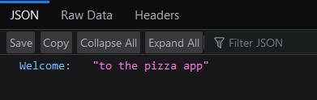

# pizzaApp

A backend project built with FastAPI and SQLAlchemy

## Requirements

- Python ≥ 3.7
- Operating system
    - Windows
    - macOS
    - Linux

## Dependencies

- FastAPI  ≥ 0.65.2
- SQLAlchemy ≥ 1.4.22

## Installation

1. Clone the repository

```bash
git clone https://github.com/guanarp/pizzaApp
```

```
2. Clone the repository.
3. Navigate to the project directory.
4. Install the dependencies using the following command:

   ```shell
   pip install -r requirements.txt
```

1. Navigate to the project directory.

```bash
cd <my_folder>/pizzaApp
```

1. Install the dependencies.

```bash
pip install -r requirements.txt
```

## Run the project

In the directory run the following command

```bash
uvicorn src.main:app --reload

```

it should answer with the following message

```bash
INFO:     Will watch for changes in these directories: ['<my_folder>\pizzaApp']
INFO:     Uvicorn running on <address> (Press CTRL+C to quit)
INFO:     Started reloader process [<number>] using WatchFiles
INFO:     Started server process [<number2>]
INFO:     Waiting for application startup.
INFO:     Application startup complete.
```

So now we just have to load ***&lt;address&gt;*** in a browser and we can see the home page



The project is also autodocumented with swaggerUI. It also provides fast and easy manual tests.

We can access it loading ***&lt;address&gt;/docs***


It should look similar to this.

## Unit tests
It can be tested using pytest
If you are in the pizzaApp folder it's just using the command
```bash
pytest
```
It will detect the test automatically.
Notice that we don't have a delete user method so after using it for the first time it will assert an error trying to create the same user
There's some bug with  the patch methods because in the *test* the response is the previous data. But the swaggerUI works well
The delete methods also show forbidden error but in the swaggerUI also work.

## Postman
The postman collections have the requierd environment variables for every request. there's a basic token, a jwt "basic user" token and a jwt SuperUser token to test every endpoint.  

## Database

- We will use the ***pizza_database.db*** that I created with SQLite.
- One can use DBeaver or SQLite to check the tables.
- There four tables. ingredients, pizza_ingredient_association, pizzas and users

### users

| Column Name | Type | Description |
| --- | --- | --- |
| id | Integer | Primary key for the User |
| username | String | Unique username for the User |
| password | String | Hashed password for the User |
| is_active | Boolean | Flag indicating User's active status |
| permission_level | Enum | User's permission level |

### pizzas

| Column Name | Type | Description |
| --- | --- | --- |
| id | Integer | Primary key for the Pizza |
| name | String | Unique name of the Pizza |
| price | Integer | Price of the Pizza |
| is_active | Boolean | Flag indicating Pizza's active status |

### ingredients

| Column Name | Type | Description |
| --- | --- | --- |
| id | Integer | Primary key for the Ingredient |
| name | String | Unique name of the Ingredient |
| category | Enum | Category of the Ingredient (basic/premium) |

### pizza_ingredient_association

| Column Name | Type | Description |
| --- | --- | --- |
| pizza_id | Integer | Foreign key referencing the pizzas table |
| ingredient_id | Integer | Foreign key referencing the ingredients table |

## Endpoints

| Method | Endpoint | Description | Parameters |
| --- | --- | --- | --- |
| GET | / | Home endpoint to welcome users to the pizza app. | - |
| GET | /pizzas | Retrieve a list of pizzas. | - |
| GET | /pizzas/{pizza_id} | Retrieve details of a specific pizza by ID. | pizza_id: ID of the pizza to retrieve |
| POST | /pizzas/ | Create a new pizza. | new_pizza: Details of the new pizza to create |
| PATCH | /pizzas/{pizza_id} | Update the details of a pizza. | pizza_id: ID of the pizza to update |
| POST | /ingredients | Create a new ingredient. | new_ingredient: Details of the new ingredient to create |
| PATCH | /ingredients/{ingredient_id} | Update the details of an ingredient. | ingredient_id: ID of the ingredient to update |
| DELETE | /ingredients/{ingredient_id} | Delete an ingredient. | ingredient_id: ID of the ingredient to delete |
| POST | /pizzas/ingredients/{pizza_id}/{ingredient_id} | Add an ingredient to a pizza. | pizza_id: ID of the pizza <br>ingredient_id: ID of the ingredient |
| DELETE | /pizzas/ingredients/{pizza_id}/{ingredient_id} | Remove an ingredient from a pizza. | pizza_id: ID of the pizza <br>ingredient_id: ID of the ingredient |

## To-do
- The change methods don't have a validation (like the create methods have) to check if the new name is already in the database. The process is similar so it should be quick to modify this.
- Verify why the change and delete tests are not working as expected even when the requests are indeed working.
- Add pizza order methods so a client could "ask for a pizza"

